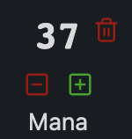

# Obsidian Progress Clocks

Progress clocks, counters, and stopwatches for [Obsidian.md](https://obsidian.md/).

## Usage

Use the `Progress Clocks: Open Sidebar View` to open the progress clocks panel (or look for the
<svg xmlns="http://www.w3.org/2000/svg" width="1em" height="1em" viewBox="0 0 24 24" fill="none" stroke="currentColor" stroke-width="2" stroke-linecap="round" stroke-linejoin="round" class="svg-icon lucide-pie-chart"><path d="M21.21 15.89A10 10 0 1 1 8 2.83"></path><path d="M22 12A10 10 0 0 0 12 2v10z"></path></svg>
icon).

By default, the panel is empty; use the "Add Section" button to create a new
grouping of progress clocks (and other trackers), then the
<svg xmlns="http://www.w3.org/2000/svg" width="1em" height="1em" viewBox="0 0 24 24" fill="none" stroke="currentColor" stroke-width="2" stroke-linecap="round" stroke-linejoin="round" class="lucide-icon lucide lucide-pie-chart "><path d="M21.21 15.89A10 10 0 1 1 8 2.83"></path><path d="M22 12A10 10 0 0 0 12 2v10z"></path></svg>,
<svg xmlns="http://www.w3.org/2000/svg" width="1em" height="1em" viewBox="0 0 24 24" fill="none" stroke="currentColor" stroke-width="2" stroke-linecap="round" stroke-linejoin="round" class="lucide-icon lucide lucide-plus-square "><rect width="18" height="18" x="3" y="3" rx="2"></rect><path d="M8 12h8"></path><path d="M12 8v8"></path></svg>, and
<svg xmlns="http://www.w3.org/2000/svg" width="1em" height="1em" viewBox="0 0 24 24" fill="none" stroke="currentColor" stroke-width="2" stroke-linecap="round" stroke-linejoin="round" class="lucide-icon lucide lucide-timer "><line x1="10" x2="14" y1="2" y2="2"></line><line x1="12" x2="15" y1="14" y2="11"></line><circle cx="12" cy="14" r="8"></circle></svg>
buttons to add clocks, counters, or stopwatches (see below) to the section.

Sections (and individual trackers) can be renamed by clicking on the their names,
and removed with the
<svg xmlns="http://www.w3.org/2000/svg" width="1em" height="1em" viewBox="0 0 24 24" fill="none" stroke="currentColor" stroke-width="2" stroke-linecap="round" stroke-linejoin="round" class="lucide-icon lucide lucide-trash-2"><path d="M3 6h18"></path><path d="M19 6v14c0 1-1 2-2 2H7c-1 0-2-1-2-2V6"></path><path d="M8 6V4c0-1 1-2 2-2h4c1 0 2 1 2 2v2"></path><line x1="10" x2="10" y1="11" y2="17"></line><line x1="14" x2="14" y1="11" y2="17"></line></svg>
button.

## Types of Trackers

### Progress Clock

Progress clocks are pie-chart-style counters with a configurable number of
segments, useful for tracking progress/steps. They were introduced in the
[Blades in the Dark](https://bladesinthedark.com/progress-clocks) RPG by
[John Harper](https://twitter.com/john_harper).

When you add a new clock, enter how many segments you want it to have. You can
add & remove segments later on the fly, as well as incrementing the current count
(i.e. how many segments are filled), using the buttons below each clock (or by
ctrl/cmd-clicking on the clock itself).

### Counter

A number (defaulting to zero) with increment/decrement buttons next to it. You
can also click on the current value to enter an exact number, or enter `+/-` in
order to add/subtract from the current value.

### Stopwatch

Keeps track of time (in seconds by default; click the `/1000` button to toggle
between seconds and milliseconds). The other buttons under the stopwatch can be
used to pause/resume the stopwatch, reset it (to 0:00), or record a lap time
(which will show up in a list under the stopwatch).