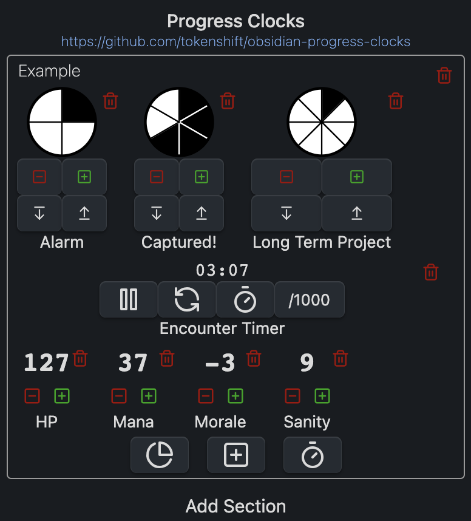
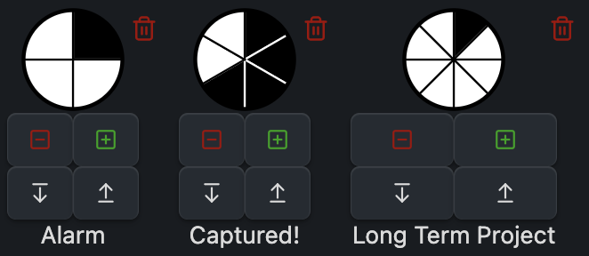

# Obsidian Progress Clocks

Progress clocks, counters, and stopwatches for [Obsidian.md](https://obsidian.md/).

## Usage

Use the `Progress Clocks: Open Sidebar View` to open the progress clocks panel.

By default, the panel is empty; use the "Add Section" button to create a new
grouping of progress clocks (and other trackers), then use the buttons at the
bottom of the panel to add clocks, counters, and stopwatches to the section (see
below for explanations of each kind of tracker).

## Types of Trackers

### Progress Clock

Progress clocks are pie-chart-style counters with a configurable number of
segments, useful for tracking progress/steps. They were introduced in the
[Blades in the Dark](https://bladesinthedark.com/progress-clocks) RPG by
[John Harper](https://twitter.com/john_harper).

When you add a new clock, enter how many segments you want it to have. You can
add & remove segments later on the fly, as well as incrementing the current count
(i.e. how many segments are filled), using the buttons below each clock (or by
ctrl/cmd-clicking on the clock itself).

### Counter

A number (defaulting to zero) with increment/decrement buttons next to it. You
can also click on the current value to enter an exact number, or enter `+/-` in
order to add/subtract from the current value.

### Stopwatch

Keeps track of time (in seconds by default; click the `/1000` button to toggle
between seconds and milliseconds). The other buttons under the stopwatch can be
used to pause/resume the stopwatch, reset it (to 0:00), or record a lap time
(which will show up in a list under the stopwatch).
